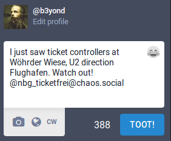
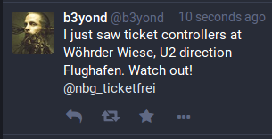

# How to use Ticketfrei

Do you want to help sousveilling ticket controllers?

## Do you want to know if it's safe to ride without a ticket at the moment?

Just look at the profile of the bot: https://chaos.social/@nbg_ticketfrei

Do you see a toot, reporting ticket controllers?
* If yes, you should probably buy a ticket for now.
In Nuremberg we made the experience that ticket controllers are usually active for about a week, a few hours every day.
So if you see that there was a warning in the last days, watch out.
* If no, you are probably fine! Dare to ride without a ticket.

We can't guarantee that you will be safe though, so still watch out.
The more people participate, the more you can trust that controllers are reported before you run into them.
So, if you have bad luck and are the first one to see the controller:

## Do you want to help others, who ride public transport without a ticket?

That's easy. You only need an Mastodon account, for example at
* https://queer.party/about
* https://soc.ialis.me/about
* https://witches.town/about
* https://kitty.town/about
* https://social.coop/about
* https://awoo.space/about

Using a twitter account or sending a mail is also possible!

Just write a toot/tweet/mail, mentioning the bot, and tell it
* Where you saw the ticket controllers
* Which line they are using, into which direction

For example like this:

The bot will soon share your message, so other people will be able to look at it and be safe.

Thanks for helping to provide public transport for everyone!
